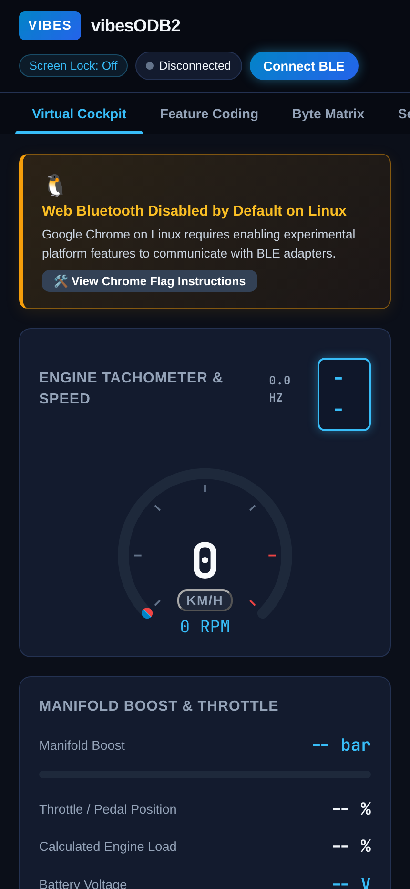
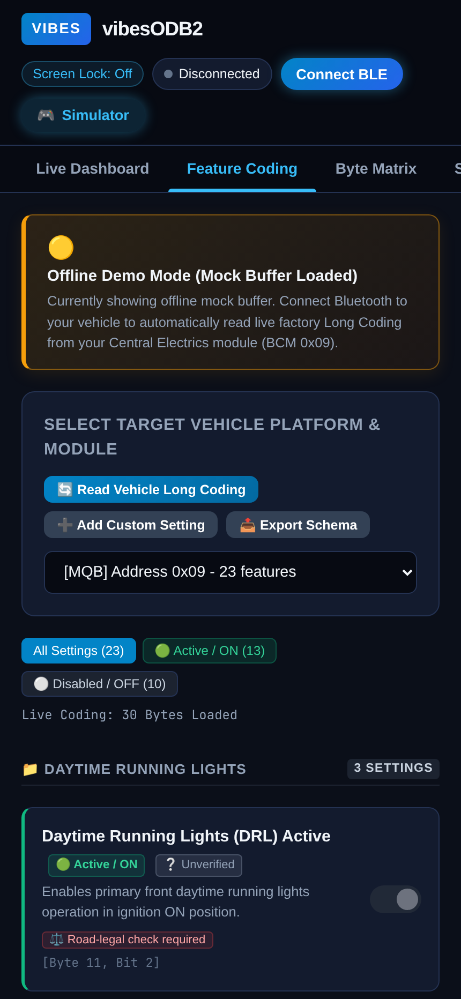
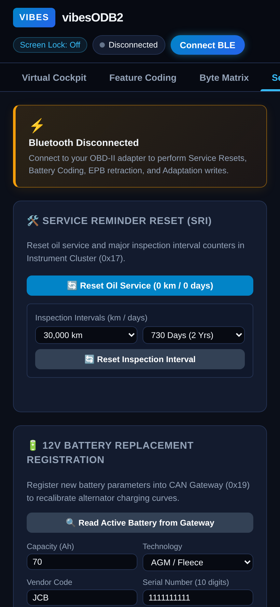
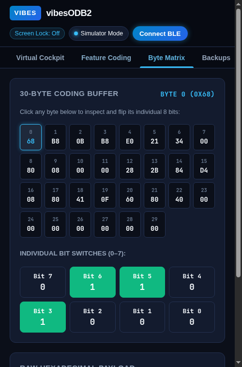

# vibesODB2

### The free and open-source diagnostics & customization tool for VAG vehicles

> [!WARNING]
> **ALPHA SOFTWARE — HARDWARE & VEHICLE VERIFICATION REQUIRED**
> vibesODB2 is currently in early **Alpha**. While automated backups and safety checks are built in, writing settings to vehicle computers carries risk. Real-world testing across different car models and adapters is ongoing. Always make sure your battery is in good health and keep your ignition ON (engine OFF) when changing settings. Use at your own risk.

**vibesODB2** is a free, zero-install vehicle diagnostic and tweak tool designed for **Volkswagen, Audi, SEAT, and Škoda** vehicles.

* 🚫 **No subscription fees or paywalled credits.**
* 🔌 **No expensive proprietary dongles** — works with standard Bluetooth OBD-II adapters.
* 📱 **Zero installation** — runs straight in your phone or laptop browser via Bluetooth.

---

## 🚀 Launch the App

👉 [**Open vibesODB2 (https://orviwan.github.io/vibesODB2/)**](https://orviwan.github.io/vibesODB2/)

| Live Digital Dashboard | Feature Tweaks (Coding) | Service & Maintenance | Byte Matrix & Inspector |
| :---: | :---: | :---: | :---: |
|  |  |  |  |

---

## ✨ What Can You Do with vibesODB2?

### 🏎️ 1. Live Digital Dashboard & Scope (Virtual Cockpit)
Stream real-time driving gauges and record telemetry runs on your mounted phone:
* **Digital Speedometer & Tachometer**: Live km/h & mph with redline alerts.
* **Turbo Boost & Engine Load**: Real-time boost gauge (bar & PSI), throttle position, and DSG gear indicator.
* **Thermal Sensors**: Coolant temperature, Intake Air temperature, and Exhaust Gas temperature (EGT).
* **Emissions & Fueling**: Diesel Particulate Filter (DPF) soot mass loading and Common Rail fuel pressure.
* **📈 Live Telemetry Scope & CSV Export**: Graph live sensor parameters in real time (VAG-Scope style) and export your driving sessions to `.csv` files.
* **Screen Wake Lock**: Keeps your phone display awake while driving.

### ⚡ 2. One-Tap Feature Tweaks (Long Coding)
Inspect your car's factory-enabled equipment and toggle enthusiast tweaks using categorized switches:
* **Active vs. Disabled Filter Pills**: Quickly filter between `🟢 Active / ON`, `⚪ Disabled / OFF`, or browse all platform settings.
* **Daytime Running Lights (DRL)**: Standard DRL, Scandinavian rear DRLs, or auto-off with handbrake.
* **Central Locking & Convenience**: Speed auto-lock (>15 km/h), auto-unlock on key extraction, and remote window roll up/down via key fob.
* **Mirrors & Lighting**: Heated exterior mirrors, passenger mirror dip in reverse gear, acoustic alarm lock beep, and dynamic cornering fog lights.
* **Wipers & Washers**: Teardrop wipe, rear wiper reverse sync, and heated rear windscreen.

### 🔧 3. Service & Maintenance Tools
Perform routine maintenance without expensive dealer tools:
* **Service Reminder Reset (SRI)**: Reset Oil Service distance and time intervals (0 km / 0 days) and custom Inspection intervals on the Instrument Cluster (`0x17`).
* **12V Battery Registration**: Read and write battery capacity (Ah), battery chemistry (`AGM`, `EFB`, `Wet`, `Gel`), vendor (`JCB`, `VAO`), and serial numbers to the CAN Gateway (`0x19`) or Battery Regulation (`0x61`).
* **Electronic Parking Brake (EPB) Service Mode**: Safely retract rear brake caliper electric motors (`0x53`) into service position for brake pad changes, and recalibrate after installation.
* **True Engine ECU Mileage**: Read untampered odometer mileage stored internally in the Engine Control Unit (`0x01`) to inspect used cars for odometer rollback.

### 🛡️ 4. Automatic Backups & One-Click Undo
Never worry about losing your original settings:
* Automatically saves an immutable snapshot before any setting is written.
* **Backup Explorer**: View byte-by-byte differences between your snapshots and active settings.
* One-tap restore gets you back to your factory baseline instantly.

### 🔍 5. Fault Code Scanner (DTCs)
* Read active and pending Diagnostic Trouble Codes across vehicle modules.
* Clear fault codes and reset warning lights (Engine Check, ABS, Airbag, BCM convenience systems) after repairs.

### 🚗 6. Vehicle & ECU Identification
* Auto-decodes your 17-digit VIN to show your exact vehicle model, model year, assembly plant, and chassis serial number.
* Reads live ECU hardware part numbers, software version numbers, and ECU serial numbers directly over UDS.

---

## 🚗 Supported Vehicles

vibesODB2 supports modern Volkswagen Auto Group (VAG) vehicles across the **PQ25**, **PQ35**, **PQ46**, and **MQB** platforms:

| Make | Supported Models | Years |
| :--- | :--- | :--- |
| **Volkswagen** | **Golf** (Mk5, Mk6, Mk7, Mk7.5, Alltrack) | 2004–2020 |
| **Volkswagen** | **Transporter** (T5.1, T6, T6.1 Caravelle / Multivan) | 2010–2024 |
| **Volkswagen** | **Polo** (Mk5 6R / 6C) | 2009–2017 |
| **Volkswagen** | **Caddy** (Mk3, Mk4) | 2004–2020 |
| **Volkswagen** | **Passat** (B6, B7, B8, CC) | 2005–2023 |
| **Volkswagen** | **Tiguan** (Mk1, Mk2) & **Touran** | 2003–2023 |
| **Volkswagen** | **Scirocco** (Mk3) | 2008–2017 |
| **Audi** | **A3 / S3 / RS3** (8P, 8V) | 2003–2020 |
| **SEAT** | **Leon** (Mk2, Mk3) & **Ibiza** (Mk4) | 2005–2020 |
| **Škoda** | **Octavia** (Mk2, Mk3) & **Fabia** (Mk2) | 2004–2020 |

---

## 🔌 What Hardware Do I Need?

You just need an inexpensive, standard Bluetooth OBD-II adapter with BLE 4.0 support:

* 🥇 **Recommended**: **Vgate vLinker MC+** (Bluetooth 4.0 BLE / works on Android & iOS)
* **Also Compatible**: **OBDLink MX+**, **OBDLink CX**, or other standard BLE OBD-II dongles.

*(Note: Cheap generic blue ELM327 clone adapters with 64-byte buffers are not recommended for coding due to packet drop risks).*

---

## 📱 How to Get Started in 3 Steps

1. **Plug in the Adapter**: Plug your Bluetooth OBD-II dongle into your car's diagnostic port (usually located under the steering wheel area).
2. **Turn Ignition ON**: Turn your car key to position 2 (Ignition ON, engine OFF for coding).
3. **Connect**: Open [**https://orviwan.github.io/vibesODB2/**](https://orviwan.github.io/vibesODB2/) on your phone and tap **Connect BLE**:
   - **Android & PC / Mac**: Works directly in **Google Chrome**, **Microsoft Edge**, and **Brave**.
   - **iPhone & iPad**: Open the web link inside [**Bluefy – Web BLE Browser**](https://apps.apple.com/app/bluefy-web-ble-browser/id1492822055) (free on the iOS App Store) because Safari restricts Bluetooth.

---

## 🤝 Sharing New Features with the Community

Discovered a new tweak or feature on your car?
1. Try your setting using the **"Add Custom Setting"** button in the app.
2. Verify that it works on your car.
3. Click **"Export Schema"** to save your custom definition file.
4. Share it with the community on GitHub so other drivers and mechanics can use it!

---

## 🛠️ Developers & Technical Documentation

Looking for protocol specifications (ISO 14229 UDS, ISO 15765-2 ISO-TP), Python CLI commands (`vibesodb2`), multi-rate telemetry math, architecture diagrams, or the test suite?

👉 **Read the [Advanced Developer Guide (ADVANCED.md)](ADVANCED.md)**

---

## 📄 Legal & Safety Disclaimer

* vibesODB2 is an independent open-source project and is **not** affiliated, endorsed, or associated with Volkswagen AG, Ross-Tech LLC, or any of their subsidiaries.
* All trademarks and model names are used strictly for reference under fair use and Right to Repair principles.
* Modifying vehicle parameters can alter vehicle lighting, warning systems, or convenience operations. The developers assume no responsibility for damage or issues resulting from the use of this software. Always test modifications responsibly.

---

## 📜 License

Distributed under the **MIT License**. See `LICENSE` for details.
