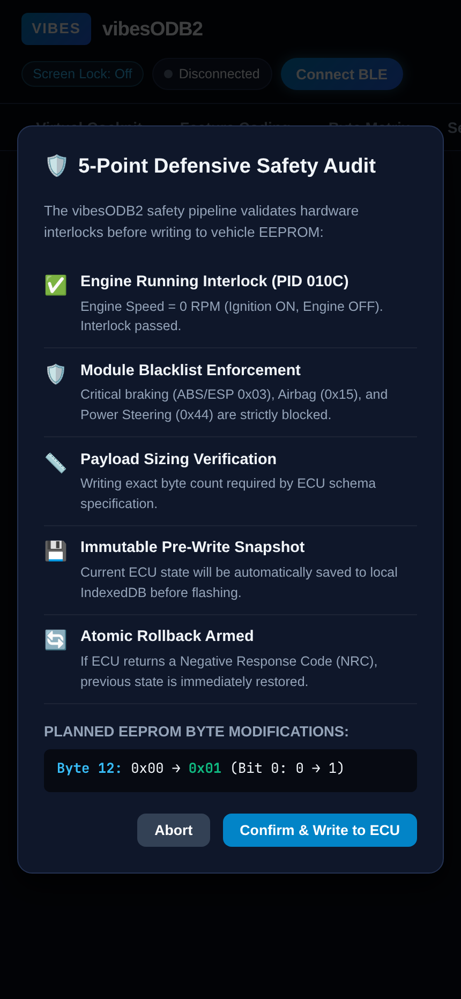
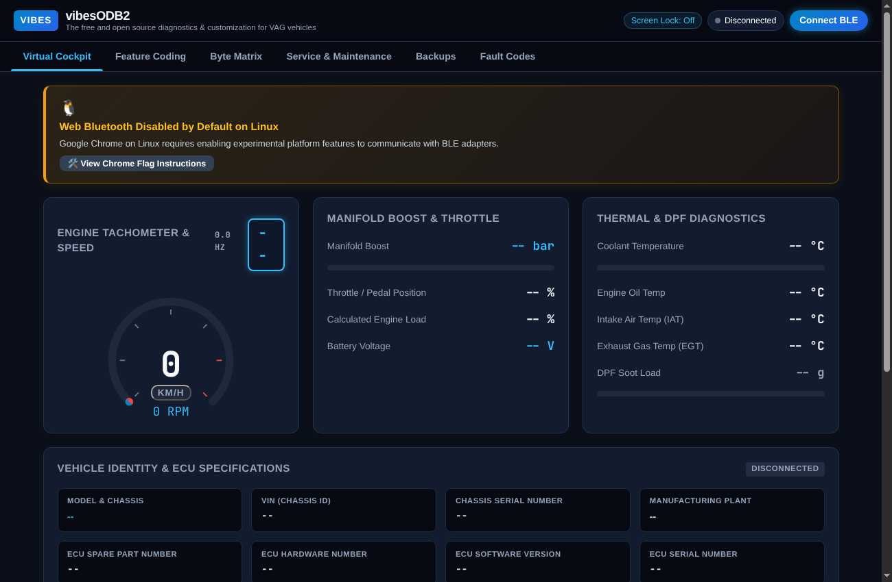
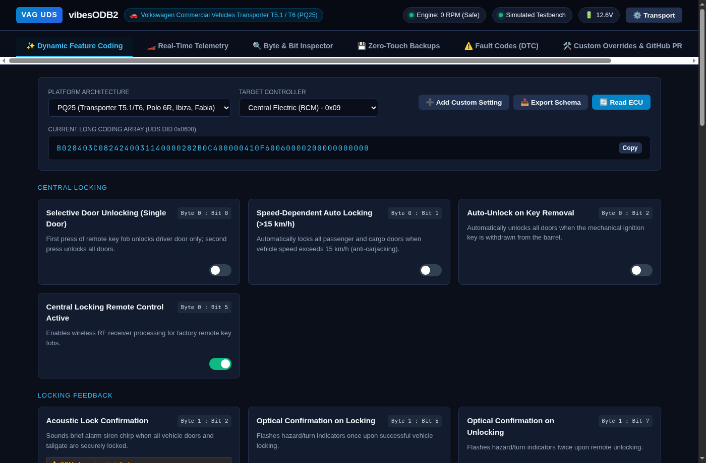
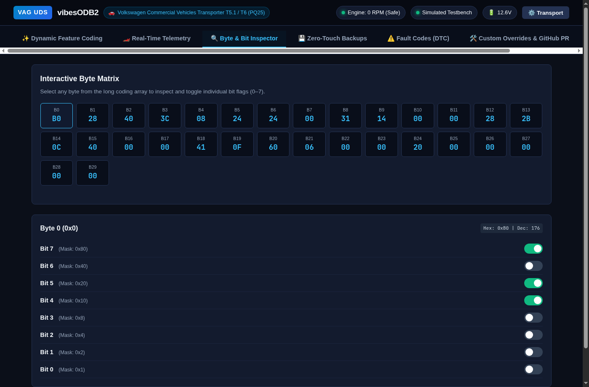
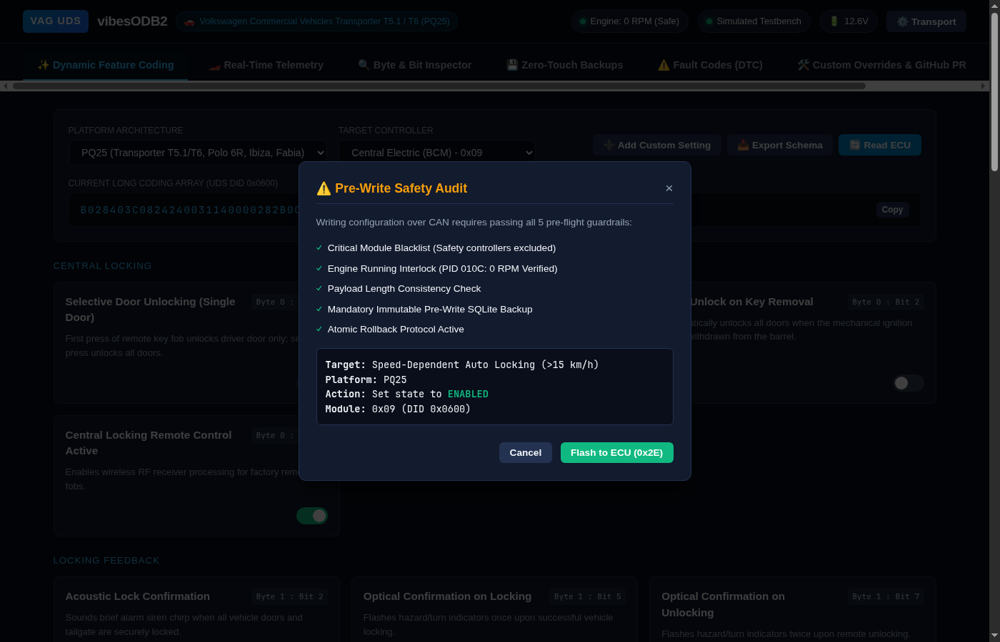
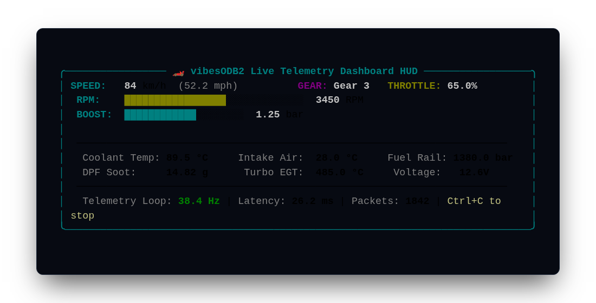

# vibesODB2

[](https://opensource.org/licenses/MIT)
[](https://www.python.org/downloads/)
[](#supported-vag-platforms--chassis-matrix)
[](https://orviwan.github.io/vibesODB2/)
[-purple.svg)](#built-with-ai)

An open-source, modular vehicle configuration and diagnostic engine engineered for the **Volkswagen Transporter (T5.1 / T6 / T6.1)** and broader **VAG platforms (PQ25, PQ35/PQ46, MQB)** across **Volkswagen, Audi, SEAT, and Škoda**.

Available as both a **Python CLI / Local Web Suite** and a zero-install **Progressive Web App (PWA)** running directly on mobile and desktop browsers with **Web Bluetooth**.

---

## 📱 Live Progressive Web App (PWA)

🚀 **Launch App:** [**https://orviwan.github.io/vibesODB2/**](https://orviwan.github.io/vibesODB2/)

vibesODB2 runs directly in your mobile browser without compiling or installing an app store binary. Connect directly to your OBD-II dongle using the browser's hardware Bluetooth stack:

| Cockpit Telemetry | Feature Coding | Byte Matrix | Safety Guardrails |
| :---: | :---: | :---: | :---: |
|  |  |  |  |

### Browser & Hardware Support:
- **Android**: Supported natively in Google Chrome, Microsoft Edge, Brave, and Samsung Internet via `navigator.bluetooth`.
- **iOS / iPadOS**: Apple Mobile Safari restricts Web Bluetooth. Open **`https://orviwan.github.io/vibesODB2/`** in [**Bluefy – Web BLE Browser**](https://apps.apple.com/app/bluefy-web-ble-browser/id1492822055) (free on the App Store), which provides full `navigator.bluetooth` standard support.
- **Laptops / Desktops**: Google Chrome, Edge, and Chromium with Bluetooth 4.0+.
- **Offline / Vehicle Use**: Fully installable as an offline PWA with standalone home screen launch and offline caching via Service Worker (`sw.js`).
- **Screen Wake Lock & Haptics**: Uses `navigator.wakeLock` to prevent phone displays from turning off in dash mounts, and provides tactile vibration alerts on redline (>4800 RPM) or thermal peaks.

---

## Built with AI

> [!NOTE]
> **Engineering Methodology**
> vibesODB2 was designed, architected, and engineered using **Advanced Agentic AI Pair Programming** powered by **Google Antigravity**.
>
> Modern automotive reverse engineering often suffers from vendor lock-in, encrypted database blobs, and proprietary diagnostic suites that hinder the Right-to-Repair movement. By applying autonomous coding agents to automotive communication protocols (ISO 14229 UDS, ISO 15765-2 ISO-TP, and ELM/STN serial abstraction), vibesODB2 achieves:
> - **Clean-Room Schemas**: Strict decoupling of vehicle bitfields from proprietary diagnostic labels.
> - **Defensive Safety Architecture**: Hardcoded 5-point safety pipelines, pre-write SQLite snapshots, and atomic rollbacks.
> - **Open Community Ecosystem**: User-defined custom bit overrides and one-click GitHub PR community schema exports.

---

## Architecture Overview

Traditional scan tools bundle proprietary, copyrighted configuration databases directly into their installers. **vibesODB2** uses a decoupled architecture separating the communication engine from the human-readable vehicle definitions:

```
+-------------------------------------------------------------------------+
|                        Application Layer (UI & CLI)                     |
|       Dynamic UI generation derived from cached schema definitions      |
|       - Standalone CLI: `cli/dump_bcm.py`, `vibesodb2` CLI        |
|       - Interactive Responsive Web Dashboard on http://127.0.0.1:8000   |
+-------------------------------------------------------------------------+
                                     |
+-------------------------------------------------------------------------+
|                      Safety & State Engine                              |
|   - Engine-off validation (PID 010C)     - Mandatory SQLite backup      |
|   - Length-checking & bitwise masking    - Critical module blacklisting |
|   - Atomic rollback execution on NRC     - In-memory bitwise engine     |
+-------------------------------------------------------------------------+
                                     |
+-------------------------------------------------------------------------+
|                      UDS Engine (ISO 14229)                             |
|   - Session Control (0x10)               - TesterPresent loop (0x3E)    |
|   - Read Data By Identifier (0x22)       - Write Data By ID (0x2E)      |
|   - Fault Management (Read 0x19 / Clear 0x14)                           |
+-------------------------------------------------------------------------+
                                     |
+-------------------------------------------------------------------------+
|                    ISO-TP Layer (ISO 15765-2)                           |
|   - Multi-frame reassembly (First Frame 0x10, Consecutive Frames 0x2x)  |
|   - Flow Control generation (0x30 00 00)                                |
+-------------------------------------------------------------------------+
                                     |
+-------------------------------------------------------------------------+
|                Hardware Abstraction Layer (HAL / BLE)                   |
|   - AT/ST command processing (vLinker / STN2120 / ELM327)               |
|   - Nordic UART Service (NUS) GATT transport (MTU 256)                  |
|   - High-fidelity Mock ECU & Dongle Transport for simulation/testing    |
+-------------------------------------------------------------------------+
                                     |
                           [ Vgate vLinker MC+ ]
                                     |
                         [ Physical OBD-II Port ]
```

---

## Supported VAG Platforms & Chassis Matrix

The engine auto-detects the vehicle platform and model directly from the 17-character VIN (positions 7 & 8):

| Platform | Chassis Codes | Primary Models | Years |
| :--- | :--- | :--- | :--- |
| **PQ25** | `7E`, `7F`, `7H`, `7J` | **VW Transporter T5.1 / T6** | 2010–2019 |
| **PQ25** | `6R`, `6C` | **VW Polo Mk5** | 2009–2017 |
| **PQ25** | `6J` | **SEAT Ibiza Mk4** | 2008–2017 |
| **PQ25** | `5J` | **Škoda Fabia Mk2 / Roomster** | 2007–2014 |
| **PQ35** | `1K`, `5K`, `AJ` | **VW Golf Mk5 / Mk6** | 2004–2013 |
| **PQ35** | `2K`, `2C` | **VW Caddy Mk3 / Mk4** | 2004–2020 |
| **PQ35** | `1T` | **VW Touran** | 2003–2015 |
| **PQ35** | `5N` | **VW Tiguan Mk1** | 2007–2016 |
| **PQ35** | `13` | **VW Scirocco Mk3** | 2008–2017 |
| **PQ35** | `8P` | **Audi A3 Mk2** | 2003–2013 |
| **PQ35** | `1P` | **SEAT Leon Mk2** | 2005–2012 |
| **PQ35** | `1Z` | **Škoda Octavia Mk2** | 2004–2013 |
| **PQ46** | `3C`, `36`, `CC` | **VW Passat B6 / B7 / CC** | 2005–2016 |
| **MQB** | `5G`, `BA`, `AU` | **VW Golf Mk7 / Alltrack** | 2012–2020 |
| **MQB** | `7L` | **VW Transporter T6.1** | 2019–2024 |
| **MQB** | `8V` | **Audi A3 Mk3** | 2012–2020 |
| **MQB** | `5F` | **SEAT Leon Mk3** | 2012–2020 |
| **MQB** | `5E` | **Škoda Octavia Mk3** | 2012–2020 |
| **MQB** | `3G` | **VW Passat B8** | 2014–2023 |
| **MQB** | `AD`, `BW` | **VW Tiguan Mk2** | 2016–2023 |

---

## Key Capabilities

* **UDS Long Coding Read/Write:** Natively reads and updates 24- to 30-byte configuration arrays on the Body Control Module (BCM), Instrument Cluster, and Gateway.
* **Real-Time Telemetry & Multi-Tier Scheduler:** Streams live sensor telemetry while driving with tiered query frequencies (Fast 30–50 Hz loop for Speed, RPM, Boost, Throttle vs Slow 1–2 Hz loop for Coolant, IAT, Fuel Rail, and OEM VAG UDS for DPF soot loading, Turbo EGT, and DSG gear).
* **Virtual Cockpit Digital Dashboard:** Full responsive automotive instrument cluster HUD streaming over low-latency WebSockets (`/ws/telemetry`) and terminal CLI (`vibesodb2 live`).
* **Powertrain Drive Cycle Simulator:** Dynamic physics simulation of acceleration, gear shifting (1st–6th), turbo boost spooling, and engine thermal warmup for offline bench testing and UI development.
* **Decoupled Community Schemas:** Vehicle coordinate definitions (byte/bit maps) are loaded via modular, clean-room JSON schemas fetched from remote endpoints and cached locally in SQLite.
* **User Custom Overrides & GitHub PR Export:** Define your own custom feature bits, test them immediately, and export GitHub PR-ready schemas with one click.
* **Zero-Touch Backups:** Automatically captures an immutable, timestamped SQLite snapshot of the existing hex array prior to executing any write command.
* **Hardware-Accelerated ISO-TP:** Supports STN/ELM-extended chipsets (`ATCAF1`) to avoid buffer overruns and frame drops during multi-packet operations, with software fallback reassembler.
* **Comprehensive Fault Management:** Reads active and confirmed Diagnostic Trouble Codes (DTCs) across convenience and comfort modules via UDS Service `0x19`, with one-tap clearing via Service `0x14`.
* **High-Fidelity Simulation:** Develop, test, and preview coding offline with a built-in virtual STN adapter and VAG ECU testbench.

---

## Visual Preview & Interface

vibesODB2 provides both an interactive dark-mode Web Dashboard and a terminal-based live HUD:

### Virtual Cockpit Telemetry HUD
Real-time 30–50 Hz telemetry streaming showing tachometer, boost gauge, coolant temp, DPF soot loading, DSG gear, and sampling frequency:


### Dynamic Feature Coding
Clean-room bitfield decoding allowing one-click toggling of vehicle features (Needle Sweep, Cornering Lights, Tear Wiping, etc.):


### Interactive Byte Matrix & Bit Inspector
Low-level 30-byte configuration inspection with live hex view, ASCII inspection, and bit-level toggles:


### Defensive Pre-Write Safety Audit
Automated 5-point safety verification modal showing engine state, blacklists, size verification, and backup diff:


### Terminal Live Cockpit
Lightweight ANSI cockpit HUD running directly in your terminal:


---

Writing multi-byte coding payloads over CAN requires adapters with hardware flow control and extended internal receive buffers (minimum 2 KB). Generic clone ELM327 devices with small 64-byte UART buffers are **not supported** due to packet-dropping risks.

### Tested & Supported Adapters

* **Vgate vLinker MC+ (BLE 4.0 / Android & iOS)** *(Recommended)*
* **OBDLink MX+ (MFi / Bluetooth)**
* **OBDLink CX (BLE 4.0 / iOS & Android)**

### Connection Profile (BLE GATT)

* **Target Service:** Nordic Semiconductor UART Service (`UUID: 6E400001-B5A3-F393-E0A9-E50E24DCCA9E`)
* **TX Characteristic:** `6E400002-B5A3-F393-E0A9-E50E24DCCA9E` (Write without response / Write)
* **RX Characteristic:** `6E400003-B5A3-F393-E0A9-E50E24DCCA9E` (Notify)
* **Negotiated MTU:** 256 bytes

---

## Safety Guardrails & Fail-Safes

Writing to vehicle controllers carries inherent risk. The engine enforces five automated pre-flight checks:

1. **Critical Module Blacklist:** Hardcoded execution blocks prevent connections or writes to safety-critical controllers, including ABS/ESP (`0x03`), Airbag Systems (`0x15`), and Electromechanical Steering (`0x44`).
2. **Engine Running Interlock:** The tool queries standard OBD-II PID `010C` (Engine RPM) before every session transition. If RPM $> 0$, write operations are blocked. The vehicle must be in an **Ignition ON / Engine OFF** state.
3. **Pre-Write Snapshot Table:** An internal SQLite table captures the existing raw hex configuration immediately before any `0x2E` payload is dispatched:
   ```sql
   CREATE TABLE IF NOT EXISTS coding_backups (
       id INTEGER PRIMARY KEY AUTOINCREMENT,
       timestamp DATETIME DEFAULT CURRENT_TIMESTAMP,
       vin TEXT NOT NULL,
       module_address TEXT NOT NULL,
       did TEXT NOT NULL,
       raw_hex_data TEXT NOT NULL
   );
   ```
4. **Strict Payload Sizing:** If a target module returns a 30-byte payload upon read, the write engine rejects any modified payload that does not equal 30 bytes. Truncated or over-length writes are rejected client-side.
5. **Atomic Rollback:** If the controller returns a UDS Negative Response Code (`0x7F 0x2E [NRC]`), the session is terminated and the original baseline hex string is automatically re-flashed or offered as a one-tap restore from the snapshot registry.

---

## Getting Started

### Prerequisites

* Python 3.10+
* Compatible Bluetooth 4.0+ BLE adapter (e.g. Vgate vLinker MC+) or run in Mock Simulation mode.
* Linux (BlueZ), macOS, or Windows with BLE support.

### Installation

```bash
# Clone the repository
git clone https://github.com/your-org/vibesodb2.git
cd vibesodb2

# Create virtual environment and install
python3 -m venv .venv
source .venv/bin/activate
pip install -e .
```

### Basic CLI Verification

Run the verification script to connect, initialize the adapter, and extract the current BCM Long Coding string:

```bash
# Using physical BLE adapter (Ignition ON, Engine OFF)
python cli/dump_bcm.py --mac "AA:BB:CC:11:22:33"

# Or using the built-in ECU Simulator (offline testbench)
python cli/dump_bcm.py --mock
```

---

## Unified CLI Commands

The `vibesodb2` CLI provides full diagnostic and coding workflows:

```bash
# 1. Scan for nearby BLE OBD-II adapters
vibesodb2 scan

# 2. Dump BCM long coding (auto-detects platform from VIN or specify --platform)
vibesodb2 dump --mock
vibesodb2 dump --mock --platform PQ35
vibesodb2 dump --mac "AA:BB:CC:11:22:33"

# 3. Enable a feature with pre-write safety audit and confirmation
vibesodb2 set --mock --feature cornering_fog_lights --enable

# 4. View immutable SQLite backup snapshots
vibesodb2 backups

# 5. One-click rollback to a previous backup snapshot
vibesodb2 backups --mock --restore 1

# 6. Read and clear Diagnostic Trouble Codes (DTCs)
vibesodb2 dtc --mock
vibesodb2 dtc --mock --clear

# 7. List, add custom settings, and export schemas for GitHub PR
vibesodb2 schema list
vibesodb2 schema add --platform PQ25 --module 0x09 --id custom_horn --byte 2 --bit 5 --name "Alarm Horn Honk" --desc "Beeps horn on lock"
vibesodb2 schema export --platform PQ25 --module 0x09 --out community_pq25_bcm.json

# 8. Stream Real-Time Telemetry to Terminal Live HUD
vibesodb2 live --mock
vibesodb2 live --mock --drive-mode spirited --rate 40
vibesodb2 live --mac "AA:BB:CC:11:22:33"

# 9. Launch the interactive Web Dashboard
vibesodb2 web --mock
```

---

## Real-Time Telemetry & Digital Dashboard

While Long Coding operations strictly require the engine to be OFF, **Real-Time Telemetry** operates continuously while driving. It combines standard universal OBD-II (SAE J1979 / Service 0x01) with deep manufacturer-specific VAG UDS (Service 0x22).

### Multi-Frequency Tiered Scheduler

Because OBD-II operates on a request-response protocol over Bluetooth, polling all parameters sequentially reduces refresh rates. vibesODB2 solves this with an asynchronous multi-rate scheduler:

| Frequency Tier | Rate Target | Monitored Parameters | Protocol & Service |
| :--- | :--- | :--- | :--- |
| **FAST LOOP** | **20–50 Hz** (20–50 ms) | Vehicle Speed, Engine RPM, Turbo Boost Pressure (MAP), Throttle Position | Standard OBD-II (Mode 01) |
| **SLOW LOOP** | **1–2 Hz** (1000–2000 ms) | Coolant Temp, Intake Air Temp (IAT), Common Rail Fuel Pressure, Engine Runtime | Standard OBD-II (Mode 01) |
| **OEM VAG UDS** | **2–5 Hz** (200–500 ms) | DPF Soot Mass Measured (DID `0x1154`), Turbo EGT (`0x1155`), DSG Engaged Gear (`0x1156`) | VAG UDS (Service 0x22) |

---

## Interactive Web Dashboard

Launch the browser-based configuration dashboard:

```bash
vibesodb2 web --mock
# Open http://127.0.0.1:8000 in your browser
```

Features included in the Web UI:
- **🏎️ Real-Time Telemetry Cluster**: Sleek automotive instrument cluster streaming over WebSockets (`/ws/telemetry`):
  - Radial tachometer arc with redline threshold colors.
  - Large digital speedometer with `km/h` vs `mph` toggle.
  - Glowing DSG gear indicator (`D1`–`D7`, `N`, `P`, `R`).
  - Turbo boost pressure gauge (bar & PSI).
  - Thermal diagnostic meters (Coolant, IAT, Turbo EGT).
  - Common rail fuel pressure & DPF soot mass loading meters with status warnings.
  - Telemetry diagnostics HUD (live sampling Hz, round-trip latency in ms, packet count).
  - Drive cycle profile switcher (`City Commute`, `Highway Cruise`, `Spirited Run`, `Engine Idle`).
- **Vehicle Platform Switcher & VIN Auto-Detection**: Automatically identifies your van or car (e.g. `🚗 Volkswagen Transporter T5.1 (PQ25)` or `Volkswagen Golf Mk6 (PQ35)`).
- **Real-Time Pre-Flight Monitor**: Displays connection state, battery voltage, and Engine RPM safety interlock.
- **Dynamic Feature Toggles**: Checkboxes and toggle switches generated dynamically from decoupled community JSON schemas.
- **Custom Override Manager**: Add your own discovered byte/bit settings directly from the UI and save them to your local database.
- **Community Schema Exporter**: Export clean-room JSON definitions formatted and ready for GitHub pull requests.
- **Interactive Byte Matrix**: Click any byte in the 30-byte array to inspect, flip, or clear individual bit flags.
- **Pre-Write Safety Audit Modal**: Interactive visual diff of changed bytes, bit flips, and safety guardrail checks before flashing.
- **Snapshot & Rollback Registry**: View historical backups and rollback to factory settings with one click.
- **DTC Diagnostic Center**: Scan trouble codes across modules and clear faults with a single tap.

---

## Contributing Community Schemas

We welcome contributions of reverse-engineered clean-room vehicle definitions:
1. Test your bit settings on your vehicle using the **"Add Custom Setting"** feature in the CLI or Web UI.
2. Verify that the feature functions as expected.
3. Export the schema using `vibesodb2 schema export` or the Web UI download button.
4. Submit a Pull Request to the schemas repository.

---

## Legal & Safety Disclaimer

* This project is an independent open-source initiative and is **not** affiliated, endorsed, or associated with Volkswagen AG, Ross-Tech LLC, or any of their subsidiaries.
* All trademarks, platform codes, and registered names belong to their respective owners and are used strictly for reference and vehicle interoperability under fair use and Right to Repair frameworks.
* Modifying vehicle parameters can alter vehicle lighting, warning systems, and convenience operations. The developers assume no responsibility for physical damage, system lockout, MOT/inspection failure, or traffic infractions resulting from the use of this software. Always test modifications in a controlled environment.

---

## License

Distributed under the **MIT License**. See `LICENSE` for details.
